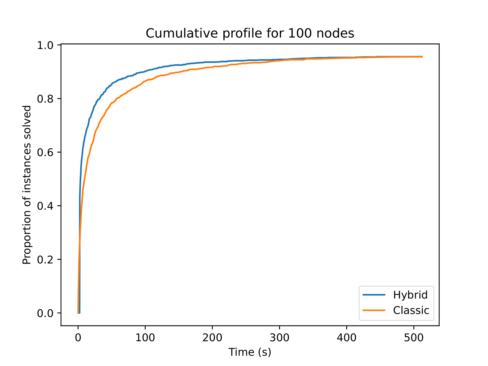
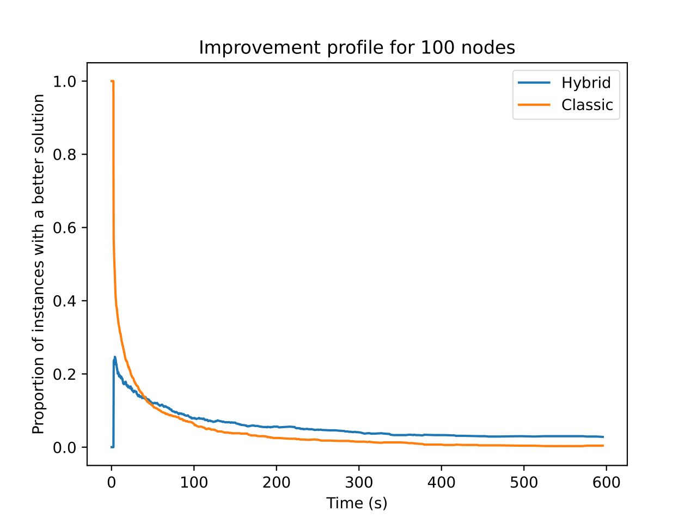

# Graph Convolutional Branch and Bound TSP Solver

This repository contains the implementation of the Graph Convolutional Branch and Bound solver for the Traveling Salesman Problem. It combines a 1Tree branch and bound proposed by [Held and Karp](https://pubsonline.informs.org/doi/10.1287/opre.18.6.1138) with the Graph Convolutional Network proposed by [Joshi, Laurent, and Bresson](https://arxiv.org/abs/1906.01227). In the [`src`](./src) folder, you can also find a Cplex TSP solver that I developed to verify the correctness of the hybrid one.

## Ideas 

The Graph Conv Net is used to preprocess the input Graph to create a distance matrix file. Each entry in this file will be a pair $(w_{ij}, p_{ij})$, where $w_{ij}$ is the weight of the Edge between nodes $i$ and $j$, computed as the euclidean distance, and $p_{ij} \in [0,1]$ is the probability, obtained by the neural network, that the corresponding Edge is part of the optimal tour. I will leverage this probabilistic information to expedite the exploration of the branch and bound tree.

## 1-Tree Branch and Bound

To improve efficiency, the original 1-Tree Branch and Bound approach proposed by Held and Karp was not implemented. Instead, a modified version, well described in the [Valenzuela and Jones](https://www.sciencedirect.com/science/article/abs/pii/S0377221796002147?via%3Dihub) paper, was used.

## Graph Convolutional Network

I used the pre-trained Graph Conv Nets that Joshi released in the [official repository](https://github.com/chaitjo/graph-convnet-tsp) of the paper. These networks were trained on one million instances of Euclidean TSP, with cities sampled from the range $[0,1] \times [0,1]$ and sizes of 20, 50, and 100 nodes. The edge embeddings from the last convolutional layer were transformed into a **probabilistic adjacency matrix** using a multi-layer perceptron with softmax. I refer you to this repository to download the trained models and to build the correct Python environment for the forward step.

## Neural Grafting

The hybrid solver obtains the probabilities for each Edge of being in the solution using a Graph Conv Net, it then assigns to a 1-Tree the probability of being the optimal tour by averaging the probabilities of its edges. It then uses these values as follows:
1. **Starting vertex**: to construct a 1Tree, and so solving the relaxed version of the TSP a **starting vertex** must be chosen. The algorithm tries all verticies and then select the one that yields the best lower bound. If multiple verticies produce the same lower bound, the one with the highest probability is chosen;
2. **Probabilistic nearest neighbor**: the algorithms needs an initial feasible solution. In the classical solver, this is accomplished by executing the nearest neighbor algorithm with each vertex as the starting city and then selecting the lowest tour found as the initial tour. The hybrid solver also uses a prob-nearest-neighbor algorithm. Starting from each city, it selects at every step the unvisited city that is linked to the current one by the edge with the highest probability. The tour found with this algorithm is then compared with the one returned by the nearest neighbor, and the best one is used as the initial feasible solution;
3. **Node Selection**: all subproblems generated by the branching steps are stored and sorted from lowest to highest. In the Hybrid Solver when two subproblems have the same value, the one with the highest probability is selected first in a **Best-First-Prob** manner. This procedure is extremely flexible, as it provides meta-parameters that allow for the modification of the subproblems sorting criterion, enabling any desired trade-off between the probability and the value of 1Trees.
4. **Variable Selection**: hen a 1Tree is not a correct tour but provides a lower bound on the current best solution found, a branching step must be taken. The selection of the edge to be fixed as mandatory or forbidden in the new branch and bound nodes is accomplished by integrating the [Shutler's method](https://www.jstor.org/stable/254144) with the edge probabilities.

## Code Documentation
All code documentation was completed using [Doxygen](https://www.doxygen.nl/), and is accessible in both [online](https://www.lorenzosciandra.com/assets/projects/GraphConvolutionalBranchandBound) and [PDF](./res/docs/documentation.pdf) formats.

## Results
Below are some of the results obtained:

Cumulative Profiles           |  Performance Profiles
:-------------------------:|:-------------------------:
 |  
